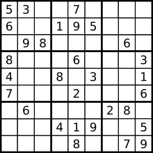
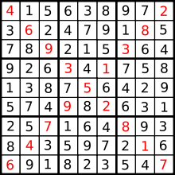

## Sudoku

Avec ce kata, qui fait suite au kata pour juniors nommé "sudoku" (où l'on vous demandait de vérifier si une grille déjà 
complètement remplie consituait une solution valide) vous allez vous initier aux joies du [retour arrière/retour sur trace/backtracking](https://fr.wikipedia.org/wiki/Retour_sur_trace)),
et ainsi coder un programme permettant de remplir une grille de Sudoku
 
Comme d'habitude ~~Je me lève et je te bouscule
                   Tu n'te réveilles pas
                   Comme d'habituuudeeeeee~~ (oups désolé, j'ai confondu Sudoku avec karaoké) on vous fournit gracieusement un fichier de tests pour vous
 guider dans vos recherches.

Pour celles et ceux qui ne connaîtraient pas le principe de ce jeu, quelques précisions:  
Voici comment se présente une grille de Sudoku:  

Une grille de Sudoku se présente sous la forme d'une grille carrée de 9 lignes et 9 colonnes subdivisée en 9 sous-grilles carrées 
de 3 par 3 cases, appelées « régions », et partiellement pré-remplie avec des chiffres de 1 à 9.  
Le but de ce jeu (*et du kata*) est de remplir entièrement la grille avec les chiffres de 1 à 9 de telle façon que 
chaque chiffre apparaisse **une
fois et une seule** dans chaque ligne, dans chaque colonne et dans chaque région.

Voici un autre exemple de grille de Sudolu résolue, dont les chiffres initiaux figurent en rouge, sur les diagonales:  

Pour plus de détails sur l'historique, les méthodes de résolution, etc: [l'article de wikipedia sur le Soudoku](https://fr.wikipedia.org/wiki/Sudoku)
 
Vous trouverez dans le même répertoire un fichier de tests (thanks to [codewars](https://www.codewars.com/) pour les grilles),
 le but étant évidemment que votre code ~~casse la baraque~~ passe les tests !

#### Pour les tests
Pour lancer les tests fournis, vous aurez besion de la gem Minitest. Pour l'installer, ouvrez votre terminal
et lancer la commande suivante:

    gem install minitest

Si vous voulez une sortie  en couleurs, rajoutez `require 'minitest/pride'` en haut du fichier test, ou notez l'instruction
 alternative, ci-dessous, pour lancer le fichier test.

Pour lancer les tests, depuis le dossier de l'exercise, utilisez cette commande:

    ruby sudoku_test.rb

pour inclure la couleur, utiliez plutôt cette commande:

    ruby -r minitest/pride sudoku_test.rb

### English version

The goal of this kata is to solve a Sudoku grid (each and every row, column, and region (a 3x3 
box) contains the numbers one through nine only once..) for [more explanations of this game, the Wikipedia page](https://en.wikipedia.org/wiki/Sudoku).

With this README, you can find in the same directory a file with some tests.

For running the tests provided, you will need the Minitest gem. Open a
terminal window and run the following command to install minitest:

    gem install minitest

If you would like color output, you can `require 'minitest/pride'` in
the test file, or note the alternative instruction, below, for running
the test file.

Run the tests from the exercise directory using the following command:

    ruby sudoku_test.rb

To include color from the command line:

    ruby -r minitest/pride sudoku_test.rb

